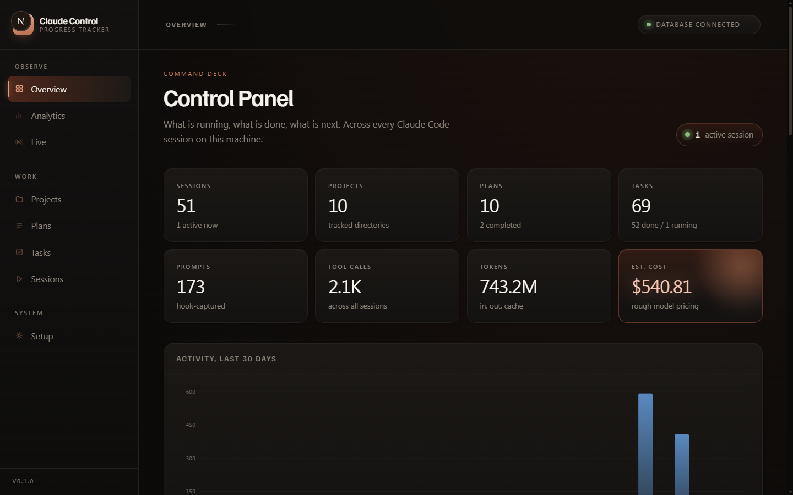
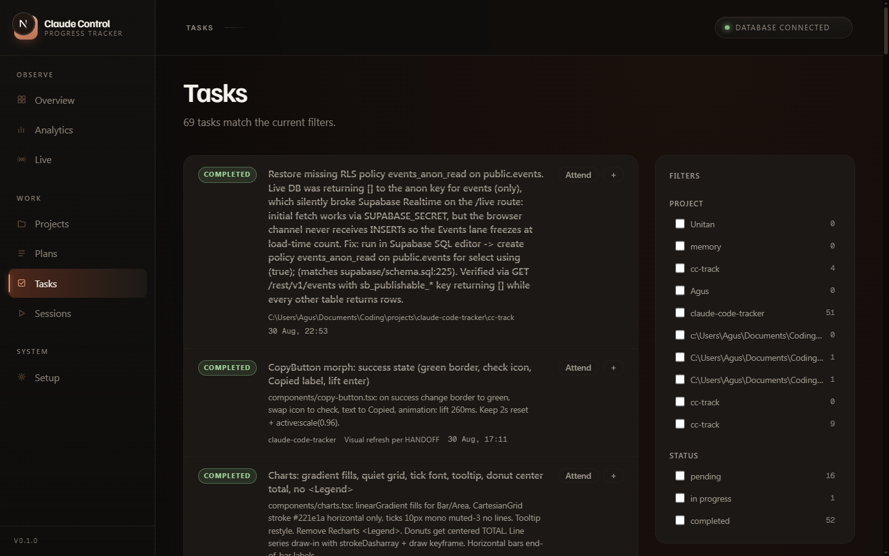
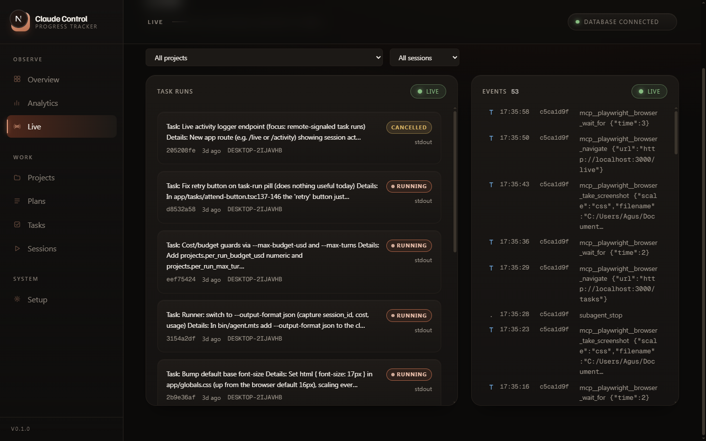
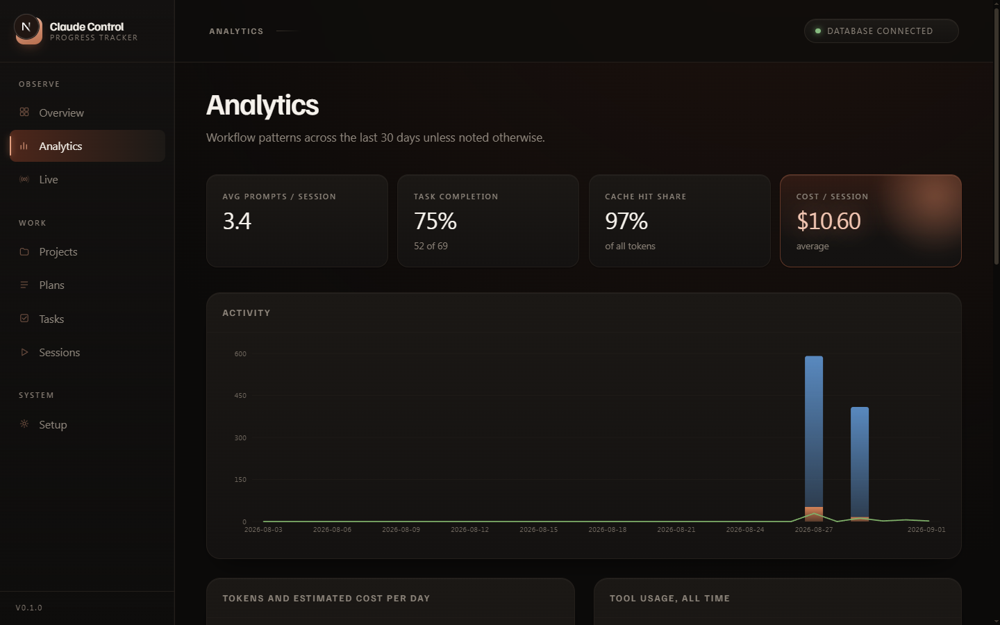
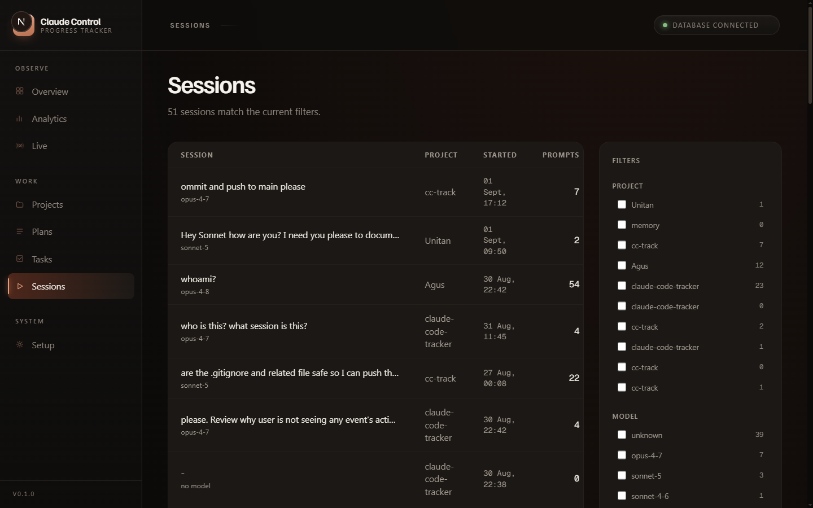

# CC·Track: Claude Code session, plan & task tracker

A **Next.js 16 + Supabase** app that records everything you do in Claude Code:
every session, the project it ran in, the plans you create, the tasks that get
executed, tool usage, prompts, tokens and estimated cost, plus workflow
analytics over all of it.

```
┌────────────────┐   hooks (stdin JSON)      ┌──────────────┐   service key   ┌───────────┐
│  Claude Code   │ ──▶ claude-tracker.mjs ─▶│ Next.js API  │ ──────────────▶│  Supabase |
│  (your mac/pc) │ ──▶ cctrack CLI ────────▶│ /api/ingest  │                 └───────────┘
└────────────────┘                           └──────────────┘
```

**Data model**: `projects` (auto-created per working directory) → `sessions`
(PK = Claude's session UUID) → `plans` → `tasks`, plus a raw `events` log
(prompts, tool calls, TodoWrite syncs) used for the analytics.

## Screenshots

**Overview** — totals, 30-day activity, recent sessions, active plans and open tasks at a glance.


**Tasks** — filter by project/status; the **Attend** button queues a remote run for the local agent to pick up.


**Live** — real-time feed of task runs and session events, two lanes, filterable and pausable.


**Analytics** — activity, tokens & cost per day, tool usage, session durations, hour-of-day prompting.


**Sessions** — every session captured by the hooks, with tokens, cost and status.


Setting this up on a new machine? [SETUP_GUIDE.md](SETUP_GUIDE.md) walks
through Supabase, the three required keys, running the app and a tour of
every route, in more depth than the quick-start below.

## 1 · Supabase

1. Create (or open) a Supabase project.
2. SQL Editor → New query → paste `supabase/schema.sql` → **Run**.
3. Settings → API: copy the **Project URL** and the secret key (`sb_secret_...`,
   labeled **service_role** on older projects).

## 2 · Configure & run the app

```bash
cp .env.example .env.local   # fill in the three values
npm install
npm run dev                  # http://localhost:3000
```

Check `http://localhost:3000/api/health`: both flags should be `true`.
The `/setup` page shows live status + all instructions in-app.

### Prod server with auto-shutdown (`./start.sh`)

If you'd rather not leave a dev server running, `./start.sh` runs
`next start` and shuts it down when no open+visible browser tab has been seen
for `IDLE_TIMEOUT` seconds. The root layout pings `/api/heartbeat` every 10s
while `document.visibilityState === "visible"`, so a closed tab, a switched-away
tab, or a minimized window all count as idle.

```bash
npm run build
./start.sh                       # uses IDLE_TIMEOUT from .env.local, default 60s
IDLE_TIMEOUT=300 ./start.sh      # per-run override wins over .env.local
```

Set `IDLE_TIMEOUT` in `.env.local` (see `.env.example`) to change the default.

**Windows: double-click to run invisibly.** `start-hidden.vbs` launches
`./start.sh` through Git Bash with no window at all. Double-click it (or
pin/shortcut it) and the server runs in the background; it exits on its own
when `IDLE_TIMEOUT` is reached. If your Git for Windows lives somewhere other
than `C:\Program Files\Git\`, edit the one path inside the `.vbs`. To stop it
manually before it idles out, kill the `node.exe` process in Task Manager.

**Note on tab behavior.** When the server exits the browser tab stays open
(browsers block page JS from closing user-opened tabs, by design); you'll
just see `ERR_CONNECTION_REFUSED` on the next request. Re-run `./start.sh`
or double-click the `.vbs` and refresh.

## 3 · Wire Claude Code (auto ingestion)

```bash
node hooks/install.mjs --url http://localhost:3000 --key <CC_TRACKER_API_KEY>
```

This writes `~/.cc-track/config.json` and prints a snippet to merge into
`~/.claude/settings.json`:

```json
{
  "hooks": {
    "SessionStart": [
      { "hooks": [ { "type": "command", "command": "node /ABS/PATH/cc-track/hooks/claude-tracker.mjs", "async": true } ] }
    ],
    "UserPromptSubmit": [
      { "hooks": [ { "type": "command", "command": "node /ABS/PATH/cc-track/hooks/claude-tracker.mjs", "async": true } ] }
    ],
    "PostToolUse": [
      { "matcher": "*", "hooks": [ { "type": "command", "command": "node /ABS/PATH/cc-track/hooks/claude-tracker.mjs", "async": true } ] }
    ],
    "Stop": [
      { "hooks": [ { "type": "command", "command": "node /ABS/PATH/cc-track/hooks/claude-tracker.mjs", "async": true } ] }
    ],
    "StopFailure": [
      { "hooks": [ { "type": "command", "command": "node /ABS/PATH/cc-track/hooks/claude-tracker.mjs", "async": true } ] }
    ],
    "SubagentStart": [
      { "hooks": [ { "type": "command", "command": "node /ABS/PATH/cc-track/hooks/claude-tracker.mjs", "async": true } ] }
    ],
    "SubagentStop": [
      { "hooks": [ { "type": "command", "command": "node /ABS/PATH/cc-track/hooks/claude-tracker.mjs", "async": true } ] }
    ],
    "Notification": [
      { "hooks": [ { "type": "command", "command": "node /ABS/PATH/cc-track/hooks/claude-tracker.mjs", "async": true } ] }
    ],
    "SessionEnd": [
      { "hooks": [ { "type": "command", "command": "node /ABS/PATH/cc-track/hooks/claude-tracker.mjs", "async": true } ] }
    ]
  }
}
```

This is exactly what `node hooks/install.mjs` prints, so running the installer
(above) is the recommended way to get this snippet, rather than copying it
from here by hand. All nine events are wired by default (`async: true` so
none of them block Claude Code), and every one is written to the `events`
table. Any hook event not in the table below (or a future one Claude Code
adds) still gets logged, generically, through a catch-all case.

What gets captured automatically:

| Hook               | Captured                                                                                                                          |
| ------------------ | ---------------------------------------------------------------------------------------------------------------------------------- |
| `SessionStart`     | new session row, project (from cwd), source (startup/resume/clear), git branch, repo written onto the project                     |
| `UserPromptSubmit` | prompt count incremented, session title set from the first prompt, raw prompt event (truncated to 4000 chars)                     |
| `PostToolUse`      | every tool call (name + trimmed input/response + tool_use_id), running tool-use count and per-tool breakdown; **TodoWrite calls sync into `tasks` instead of being logged as a plain tool event** |
| `Stop`             | transcript summary: model, input/output/cache-read/cache-creation tokens, tool-use count + breakdown, estimated cost, last assistant message (truncated), session marked ended            |
| `StopFailure`      | error type + message, recorded both as the session's last error and as a `stop_failure` event                                     |
| `SubagentStart`    | agent_type and agent_id of the spawned subagent                                                                                    |
| `SubagentStop`     | agent_type, agent_id, and the subagent's last assistant message (truncated to 4000 chars)                                        |
| `Notification`     | notification type and message text                                                                                                 |
| `SessionEnd`       | session status set to ended, ended_at timestamp, end reason                                                                        |

The hook script fails silently and exits 0; it can never block Claude Code.

## 4 · Plans & tasks: `cctrack` CLI

```bash
npm link        # exposes `cctrack` globally (from this folder)

cctrack plan add --title "Refactor auth to JWT" --desc "optional context"
cctrack task add --plan <plan-id> --content "Write migration"
cctrack task start <task-id>
cctrack task done <task-id>
cctrack plan done <plan-id>
cctrack session current     # session the hooks last saw
cctrack session end
```

The CLI targets the **current session automatically** (hooks keep
`~/.cc-track/current-session.json` in sync), or pass `--session <uuid>`.

**Let Claude do the bookkeeping:** paste `CLAUDE.md.snippet` into your
project's `CLAUDE.md` and Claude will create a plan at the start of each piece
of work and keep task statuses updated as it executes them.

## 5 · Remote task runs: Attend

Every task on `/tasks` has an **Attend** button; clicking it queues a `task_runs` row with a prompt built from the task (plus its plan and its project's path). Runs only execute once you also have a local agent process running:

```bash
npm run agent   # node --env-file=.env.local --import tsx bin/agent.mts
```

This process polls for queued runs, claims one, and shells out to `claude -p <prompt>` with `cwd` set to the project's path on disk, so the child's own hooks still feed the dashboard. As it runs, the row's status moves from `claimed` to `running` to `done`, `error` or `cancelled`, visible live on `/tasks` and `/live`. When it finishes, the run records the child's Claude session id, cost and token usage; if the project is a git repo, a short verifier pass then grades the diff and stores a verdict (pass, fail, needs review), and the task is auto-completed unless the verdict says otherwise.

## 6 · The dashboard

- **Overview**: totals (sessions, plans, tasks, prompts, tokens, cost), 30-day activity, recent sessions, active plans, open tasks
- **Projects**: auto-detected from cwd; per-project sessions, tokens, cost, task progress
- **Plans**: grouped by status with task checklists and progress bars
- **Tasks**: the task list, filterable by project and status; the **Attend** button queues a remote run (see "Remote task runs" above) and shows its status inline as it executes
- **Sessions**: table of every session; detail view has tool usage chart, plan/task lists and a full event timeline
- **Live**: real-time feed of remote task runs and session events in two lanes, newest at top; filter either lane by project or session, pause a lane to stop auto-scroll
- **Analytics**: activity, tokens & cost per day, tool usage ranking, task completion, sessions by model, session durations, hour-of-day prompting
- **Setup**: live env status + copy-paste instructions

## Security notes (single-user setup)

- All DB access is server-side with the **SUPABASE_SECRET** key (the legacy
  **service_role** key also works, as a fallback); RLS is enabled with no
  policies, so the anon key can't read anything.
- `/api/ingest/*` requires `x-api-key: $CC_TRACKER_API_KEY`.
- If you expose this app beyond localhost, put it behind auth/VPN; there are
  no login screens by design.

## Development

```bash
npm run test:hooks   # transcript parser unit tests (node)
npx tsx tests/lib.test.mts   # aggregation helper tests
npm run build        # typecheck + production build
```

## License

Licensed under the Apache License 2.0. See [LICENSE](LICENSE).
